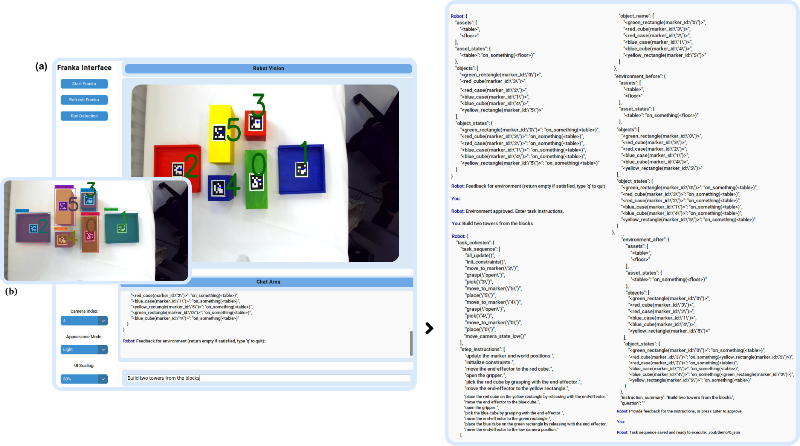
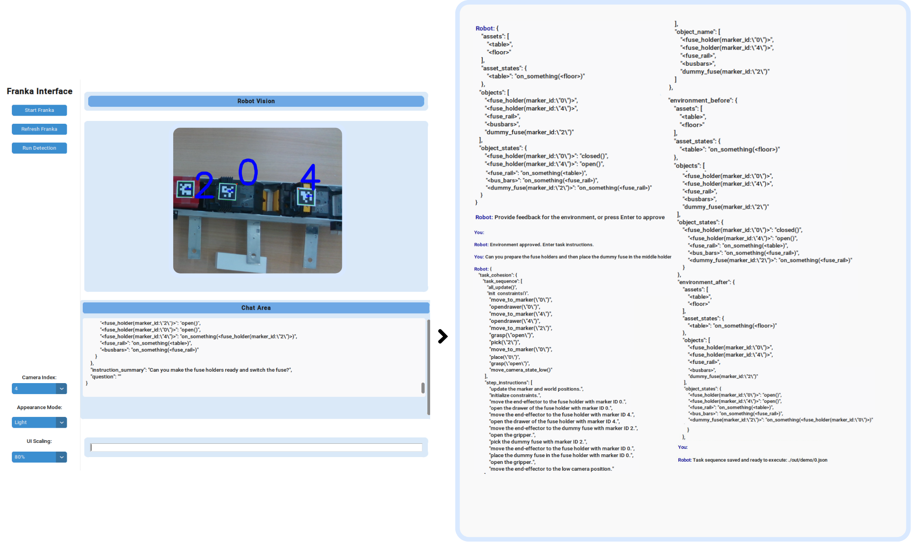
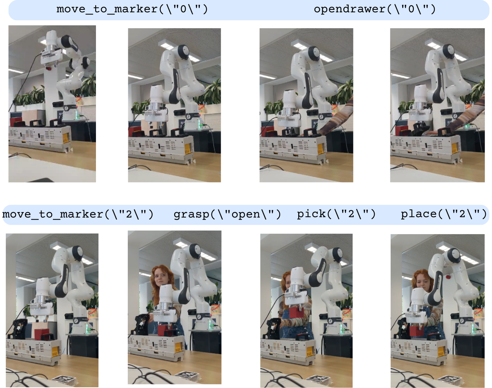

# LERACS
**LERACS: LLM-Enhanced Robotic Affordance and Control System**

The system that is designed, abbreviated for simplicity LERACS, provides a vision and control method for manipulation affordance with the use of OpenAI's ChatGPT API in a few-shot setting. In the vision method images are translated into vision input information for the control method, and perceptually grounded. The control method uses this vision input information together with natural-language instructions, while mitigating the impact of the token limit from ChatGPT, to translate this into executable robot actions in a planned task order. This system uses customizable input prompts for both environment and task decomposition generation using ChatGPT. This system therefore generates **multi-step task plans**, an **execution query** from the task plan for the robot arm to perform, an **updated environment** from instructions and image environment data, and a **visualized scene with affordable objects for manipulation**. The figure underneath displays these decomposed parts of the system. 


## Required Software and Hardware
### Required hardware:
- Franka Emika Research 3 Robot arm
- External PC (Ubuntu 20.04)
- ZED 2 Camera mounted on flanch
- Objects with ArUco markers (marker_size=0.04)
	- DICT_5X5_50
	- DICT_5X5_100
	- DICT_5X5_250
	- DICT_5X5_1000

### Franka Emika Research 3 Robot
1. Mount the robot securely to a flat surface.
2. Connect the power cable and the controller to the robot.
3. Power on the robot, connect the Ethernet cable to the external PC and go to the interface of the IP address. Connect usb camera to the external PC as well and identify the camera index.
4. Unlock all the joints and activate the FCI.

### External PC (Ubuntu 20.04)
As the robot arm does not have an internal computer capable of running the ROS components, a separate machine is required. This machine can be anything capable of running Ubuntu 20.04, such as an Intel NUC or a laptop.

Make sure that Ubuntu is installed with a realtime kernel. This gives the opportunity to control the robot arm in real-time. Installation info can be found [here](https://frankaemika.github.io/docs/installation_linux.html).

### Ethernet Connection
Connect the Ethernet cable to the port on the robot and to a port on the PC. So that the PC can connect to the robot driver via the Ethernet connection, the wired connection has to be configured in the following way:

### ROS
This project was developed using ROS Noetic. It may work with other ROS releases, but it is recommended to set up a Noetic environment on the external PC, using these [instructions](http://wiki.ros.org/noetic/Installation/Ubuntu).


## Installation 
1. Create a new workspace directory that includes a `src` directory.
2. Clone the following repositories into the same `catkin_ws`:

    ```sh
    mkdir ~/catkin_ws/src
    cd ~/catkin_ws/src
    git clone git@github.com:leonoorverbaan/LERACS.git
    cd LERACS.git
    sh install.sh ~/path/to/catkin_ws
    ```

3. Source the terminal with source `/opt/ros/noetic/setup.bash` and `~/catkin_ws/devel/setup.bash`. Test the setup by running `roslaunch ROS fr3_sim.launch`. This launches the Gazebo simulation.

If the setup was successful, you should be able to set a pose goal using the rviz interface and the simulated robot will move to that position once `plan` and `execute` is pressed.

4. For running the setup on the real robot arm you can run `roslaunch ROS fr3_real.launch robot_ip:=<IP_ADRESS> load_gripper:=true`


## How to use

1. Then, go to a subfolder in [LERACS_CONTROL/](LERACS_CONTROL/).

2. Sample codes are provided for using ChatGPT through [OpenAI API](https://beta.openai.com/). Fill in the [secrets.json](secrets.json) with your credential information. Even if you do not have a subscription, you can try it out by copying and pasting the prompts into the [OpenAI's interface](https://platform.openai.com/examples).


3. Run the following command to run the whole LERACS system:

    ```sh
    python UI.py
    ```

4. More details about the contents of this subfolder can be found in [LERACS_CONTROL/](LERACS_CONTROL/) on this Github.


## Example use case
Experiments about setting and task instruction complexity have been performed on LERACS. The following is a visualization of the interface with all of LERACS components in use.


The robot interface consists of two primary areas: the **chat area** and the **robot vision area** (snapshot). The chat area allows users to communicate with the robot, receiving textual responses, while the robot vision area provides visual feedback by displaying snapshots taken by the robot. A feedback mechanism is integrated into both the robot vision method and the robot control method. This mechanism presents feedback in the chat area, reflecting the robot’s current status and actions. The interface includes additional functionalities through various buttons. These buttons enable users to start the Franka robot system (making a snapshot and initializing the back end), reinitialize the robot control node, refresh the user interface, run the detection to display manipulable objects, and change the camera index. The user interface, developed using Tkinter, serves as the connection to the back end, handling camera commands, task decomposition, and environmental interpretation facilitated by ChatGPT.



<div align="center">
  
</div>

Next to the experiments a case studies has been performed: **switching fuses on voltage racks**. The user provides the instruction **"Can you prepare the fuse holders and then place the dummy fuse in the middle holder"** in the LERACS interface.






## Credits

This project was developed as part of the Master Thesis for my (Leonoor Verbaan) MSc. Robotics at the TU Delft. The project was supervised by Yke Bauke Eisema (Cognitive Robotics, TU Delft) and Remco van Leeuwen (Research Center for Digital Technologies, Alliander).

This package is an adaption of the original [ChatGPT-Robot-Manipulation-Prompts](https://github.com/microsoft/ChatGPT-Robot-Manipulation-Prompts). Created by Naoki Wake (microsoftopensourcse).


## Contributing

This project welcomes contributions and suggestions. Most contributions require you to agree to a Contributor License Agreement (CLA) declaring that you have the right to, and actually do, grant us the rights to use your contribution. For details, visit [https://cla.opensource.microsoft.com](https://cla.opensource.microsoft.com).

When you submit a pull request, a CLA bot will automatically determine whether you need to provide a CLA and decorate the PR appropriately (e.g., status check, comment). Simply follow the instructions provided by the bot. You will only need to do this once across all repos using our CLA.

This project has adopted the [Microsoft Open Source Code of Conduct](https://opensource.microsoft.com/codeofconduct/). For more information see the [Code of Conduct FAQ](https://opensource.microsoft.com/codeofconduct/faq/) or contact [opencode@microsoft.com](mailto:opencode@microsoft.com) with any additional questions or comments.


## Trademarks

This project may contain trademarks or logos for projects, products, or services. Authorized use of Microsoft trademarks or logos is subject to and must follow [Microsoft's Trademark & Brand Guidelines](https://www.microsoft.com/en-us/legal/intellectualproperty/trademarks/usage/general.aspx). Use of Microsoft trademarks or logos in modified versions of this project must not cause confusion or imply Microsoft sponsorship. Any use of third-party trademarks or logos are subject to those third-party’s policies.


