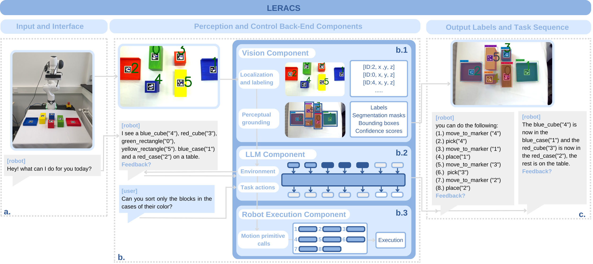

# LERACS
LERACS: LLM-Enhanced Robotic Affordance and Control System

## Introduction
The system that is designed, abbreviated for simplicity LERACS, provides a vision and control method for manipulation affordance with the use of OpenAI's ChatGPT API in a few-shot setting. In the vision method images are translated into vision input information for the control method, and perceptually grounded. The control method uses this vision input information together with natural-language instructions, while mitigating the impact of the token limit from ChatGPT, to translate this into executable robot actions in a planned task order. This system uses customizable input prompts for both environment and task decomposition generation using ChatGPT. This system therefore generates **multi-step task plans**, an **execution query** from the task plan for the robot arm to perform, an **updated environment** from instructions and image environment data, and a **visualized scene with affordable objects for manipulation**. The figure underneath displays these decomposed parts of the system. 

